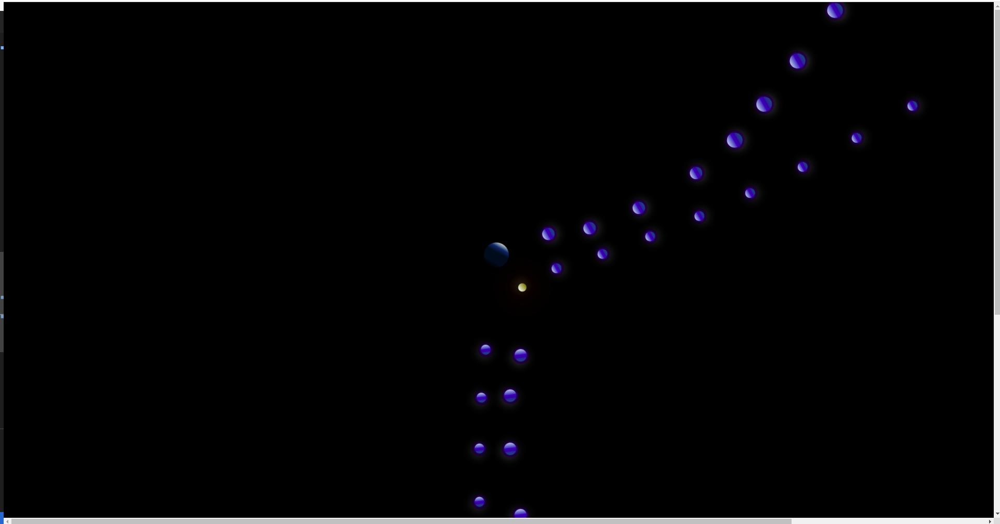

# loops_with_sass 

 
  

  <strong> planets with SASS </strong>
an example of loops in SASS using also animations
     
    <a href="https://github.com/AngelosPa/loops_with_sass/tree/main/src/scss"><strong>Explore the files »</strong></a>
     
     
    <a href="https://angelospa.github.io/loops_with_sass/">View Demo</a>
    ·
    <a href="https://github.com/github_username/repo_name/issues">Report Bug</a>
    ·
    <a href="https://github.com/github_username/repo_name/issues">Request Feature</a>
  

